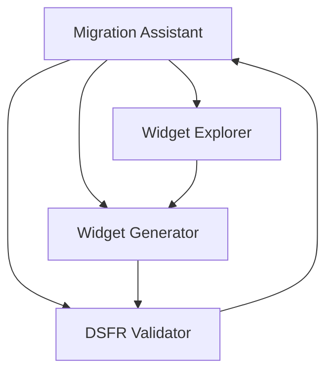

# Orchestration des Agents - Widget Builder DSFR/ODS

## Vue d'ensemble

Ce document définit l'orchestration des 4 agents spécialisés pour la transformation de 70+ widgets OpenDataSoft vers DSFR. Chaque agent a un rôle spécifique dans le workflow EPCT.

## Architecture des Agents



## Les 4 Agents Spécialisés

### 1. Widget Explorer
- **Rôle**: Explorer et analyser les widgets existants
- **Phase EPCT**: EXPLORER
- **Fichier**: `/agents/widget-explorer.md`
- **Priorité**: Première étape de tout process

### 2. Widget Generator  
- **Rôle**: Générer les widgets avec thème DSFR
- **Phase EPCT**: CODER
- **Fichier**: `/agents/widget-generator.md`
- **Priorité**: Transformation et création

### 3. DSFR Validator
- **Rôle**: Valider conformité DSFR et RGAA
- **Phase EPCT**: TESTER
- **Fichier**: `/agents/dsfr-validator.md`
- **Priorité**: Validation critique

### 4. Migration Assistant
- **Rôle**: Orchestrer la migration des 70+ widgets
- **Phase EPCT**: PLANIFIER + Orchestration
- **Fichier**: `/agents/migration-assistant.md`
- **Priorité**: Coordination globale

## Workflows d'Orchestration

### Workflow 1: Migration d'un widget unique

```bash
# 1. Explorer le widget
Task: widget-explorer "Analyser widget table dans /mcp-ods-widgets"

# 2. Générer version DSFR
Task: widget-generator "Créer table DSFR pour signalconso"

# 3. Valider le résultat
Task: dsfr-validator "Valider signalconso-table-001.html"

# 4. Documenter
Task: migration-assistant "Ajouter au rapport de migration"
```

### Workflow 2: Migration batch (70+ widgets)

```bash
# 1. Migration Assistant orchestre
Task: migration-assistant "Démarrer migration complète ODS->DSFR"
  |
  ├── Appelle widget-explorer pour inventaire
  ├── Pour chaque widget:
  │   ├── widget-generator pour création
  │   └── dsfr-validator pour validation
  └── Génère rapport global
```

### Workflow 3: Analyse et recommandations

```bash
# 1. Explorer analyse les patterns
Task: widget-explorer "Identifier patterns communs dans widgets ODS"

# 2. Migration Assistant créé templates
Task: migration-assistant "Créer templates réutilisables"

# 3. Generator utilise templates
Task: widget-generator "Générer widgets avec templates"
```

## Commandes d'Orchestration

### Commande principale
```bash
# Lance la migration complète avec orchestration
/epct migrate-all-widgets

# Ce qui déclenche:
1. widget-explorer: Inventaire complet
2. migration-assistant: Plan de migration
3. widget-generator: Génération batch
4. dsfr-validator: Validation batch
5. migration-assistant: Rapport final
```

### Commandes unitaires
```bash
# Explorer un widget spécifique
Task: widget-explorer "Analyser widget chart"

# Générer un widget
Task: widget-generator "Créer chart pour budget-vert"

# Valider un widget
Task: dsfr-validator "Valider budget-vert-chart-001.html"

# Status migration
Task: migration-assistant "Status migration widgets"
```

## Communication Inter-Agents

### Format d'échange
```json
{
  "agent": "widget-explorer",
  "action": "analyze_complete",
  "data": {
    "widget": "table",
    "complexity": "simple",
    "dsfr_equivalent": "fr-table",
    "dependencies": ["angular", "ods-widgets"]
  },
  "next_agent": "widget-generator"
}
```

### Pipeline de données
```
Explorer → Inventaire JSON → Generator
Generator → HTML → Validator  
Validator → Rapport → Migration Assistant
Migration Assistant → Status global
```

## Gestion d'État Global

### Structure de l'état
```javascript
const migrationState = {
  status: "in_progress",
  startTime: "2024-12-15T10:00:00",
  progress: {
    total: 70,
    completed: 28,
    inProgress: 2,
    failed: 0
  },
  widgets: {
    "table": { status: "completed", score: 95 },
    "chart": { status: "in_progress" },
    "map": { status: "pending" }
  },
  errors: [],
  templates: {
    created: 5,
    used: 23
  }
};
```

### Synchronisation
- État partagé via fichier `migration-state.json`
- Mise à jour après chaque action d'agent
- Rollback possible à tout moment

## Parallélisation

### Widgets indépendants
```javascript
// Peuvent être traités en parallèle
const parallel = [
  ['table', 'chart', 'map'],      // Visualisation
  ['facets', 'searchbox'],         // Filtrage
  ['gauge', 'aggregation']         // Analyse
];
```

### Widgets dépendants
```javascript
// Doivent être traités séquentiellement
const sequential = [
  'datasetContext',  // Base pour tous
  'catalogContext',  // Dépend de dataset
  'dashboardBuilder' // Dépend de tous
];
```

## Gestion des Erreurs

### Stratégie de récupération
```javascript
const errorHandling = {
  explorer_fail: {
    action: "skip_widget",
    log: true,
    notify: "migration-assistant"
  },
  generator_fail: {
    action: "retry",
    maxRetries: 3,
    fallback: "simple_template"
  },
  validator_fail: {
    action: "manual_review",
    tag: "needs_attention",
    continue: true
  }
};
```

### Circuit breaker
```javascript
// Arrêt si trop d'erreurs
if (failureRate > 0.3) {
  migrationAssistant.pause();
  migrationAssistant.generateErrorReport();
  await manualIntervention();
}
```

## Métriques et Monitoring

### KPIs par agent
```markdown
## Widget Explorer
- Widgets analysés/heure: 50
- Patterns identifiés: 12
- Taux de succès: 100%

## Widget Generator
- Widgets générés/heure: 30
- Templates utilisés: 85%
- Taux de succès: 95%

## DSFR Validator
- Widgets validés/heure: 40
- Score DSFR moyen: 92/100
- Corrections auto: 78%

## Migration Assistant
- Progression globale: 40%
- Temps estimé: 10h
- Widgets problématiques: 3
```

### Dashboard temps réel
```markdown
# Migration Dashboard

[████████░░░░░░░░] 40% | 28/70 widgets

## Agents actifs
- 🟢 Explorer: idle
- 🔄 Generator: processing chart
- 🔄 Validator: processing table
- 🟢 Assistant: monitoring

## Queue
- Pending: 42 widgets
- In progress: 2 widgets
- Completed: 28 widgets

## Santé système
- CPU: 45%
- RAM: 2.3GB
- Temps écoulé: 4h23m
- ETA: 6h37m
```

## Optimisations

### Cache intelligent
```javascript
const cache = {
  templates: new Map(),      // Templates DSFR
  transformations: new Map(), // Transformations répétitives
  validations: new Map(),    // Résultats validation
  ttl: 3600 * 24            // 24h
};
```

### Apprentissage
```javascript
// L'assistant apprend des migrations
const learning = {
  recordPattern: (widget, solution) => {
    patterns[widget.type] = solution;
  },
  suggestSolution: (widget) => {
    return patterns[widget.type] || defaultSolution;
  }
};
```

## Exemples d'Utilisation

### Migration simple
```bash
# Un seul widget
Task: widget-generator "Créer table DSFR pour signalconso"
```

### Migration complexe
```bash
# Dashboard complet avec orchestration
Task: migration-assistant "Créer dashboard SignalConso complet"

# Déclenche automatiquement:
# 1. Explorer: analyse besoins
# 2. Generator: crée 6 widgets
# 3. Validator: valide ensemble
# 4. Assistant: assemble dashboard
```

### Migration batch optimisée
```bash
# 70+ widgets avec parallélisation
Task: migration-assistant "Migration batch tous widgets avec parallélisation"

# Exécute:
# - 3 generators en parallèle
# - 2 validators en parallèle
# - 1 explorer en analyse continue
# - 1 assistant en coordination
```

## Checklist d'Orchestration

### Avant migration
- [ ] Vérifier MCPs actifs (DSFR, ODS)
- [ ] Backup widgets existants
- [ ] Définir priorités migration
- [ ] Configurer parallélisation

### Pendant migration
- [ ] Monitor progression temps réel
- [ ] Vérifier logs erreurs
- [ ] Ajuster parallélisation si besoin
- [ ] Valider widgets critiques

### Après migration
- [ ] Rapport complet généré
- [ ] Templates extraits
- [ ] Documentation mise à jour
- [ ] Widgets archivés

## Commande Maître

```bash
# Lance l'orchestration complète
claude-code orchestrate --mode=full \
  --agents="explorer,generator,validator,assistant" \
  --parallel=3 \
  --validate=true \
  --report=true

# Ce qui exécute:
1. Initialisation des 4 agents
2. Migration parallèle optimisée
3. Validation continue
4. Rapport final avec métriques
```

## Output Final Attendu

```markdown
# Migration Complète Terminée

## Résultats
- ✅ 70/70 widgets migrés
- 📊 Score DSFR moyen: 94/100
- ♿ RGAA AA: 100% conforme
- ⏱️ Durée totale: 11h45m

## Artefacts créés
- 70 fichiers HTML DSFR
- 10 templates réutilisables
- 1 rapport détaillé
- 1 guide de patterns

## Prochaines étapes
1. Revue manuelle des 3 widgets complexes
2. Intégration dans Drupal
3. Tests utilisateurs
```

---

*Document d'orchestration v1.0 - Widget Builder DSFR/ODS*
*4 agents spécialisés • Workflow EPCT • Migration automatisée*