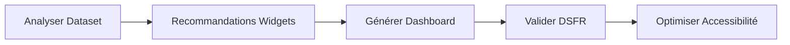
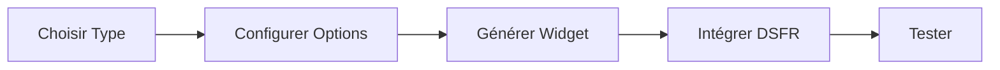

# 🚀 Guide d'Utilisation des Serveurs MCP - Widget Builder Pro

## 📋 Table des Matières
1. [Vue d'ensemble](#vue-densemble)
2. [Les 4 Serveurs MCP](#les-4-serveurs-mcp)
3. [Installation et Configuration](#installation-et-configuration)
4. [Utilisation avec Claude](#utilisation-avec-claude)
5. [Workflows Pratiques](#workflows-pratiques)
6. [Exemples Concrets](#exemples-concrets)
7. [Troubleshooting](#troubleshooting)

---

## 🎯 Vue d'ensemble

Le système MCP (Model Context Protocol) permet d'orchestrer 4 serveurs spécialisés pour la génération automatique de widgets et dashboards conformes au Design System France (DSFR).

### Architecture MCP
```
┌─────────────────────────────────────────────────┐
│                 Claude Code                      │
└────────────────────┬────────────────────────────┘
                     │ MCP Protocol
     ┌───────────────┼───────────────┬──────────────┐
     ▼               ▼               ▼              ▼
┌─────────┐    ┌──────────┐    ┌─────────┐   ┌──────────┐
│DSFR MCP │    │ODS Widget│    │Context7 │   │Angular   │
│(Docker) │    │Enhanced  │    │  (NPM)  │   │Kendo MCP │
└─────────┘    └──────────┘    └─────────┘   └──────────┘
```

---

## 🔧 Les 4 Serveurs MCP

### 1. **DSFR-MCP** (Docker)
- **Fonction** : Génération et validation de composants DSFR
- **Outils disponibles** :
  - `search_dsfr_components` : Rechercher des composants
  - `get_component_details` : Détails d'un composant
  - `generate_dsfr_component` : Générer le code HTML/CSS
  - `validate_dsfr_html` : Valider la conformité
  - `check_accessibility` : Vérifier l'accessibilité RGAA

### 2. **ODS-Widgets Enhanced** (Local)
- **Fonction** : Génération de 70+ widgets OpenDataSoft
- **Outils disponibles** :
  - `create_widget` : Créer un widget avec thème DSFR
  - `analyze_dataset` : Analyser un dataset
  - `generate_dashboard` : Générer un dashboard complet
  - `list_widgets` : Lister tous les widgets disponibles
  - `generate_widget_html` : Générer le HTML complet

### 3. **Context7** (NPM)
- **Fonction** : Documentation technique à jour
- **Outils disponibles** :
  - `resolve-library-id` : Résoudre l'ID d'une librairie
  - `get-library-docs` : Obtenir la documentation

### 4. **Angular Kendo MCP** (NPM)
- **Fonction** : Support Angular et Kendo UI
- **Outils disponibles** :
  - `kendo_angular_assistant` : Assistant pour Kendo UI Angular

---

## 💻 Installation et Configuration

### Prérequis
```bash
# Node.js 18+
node --version

# Docker (pour DSFR-MCP)
docker --version

# Claude CLI
claude --version
```

### Configuration du fichier `.mcp.json`
```json
{
  "mcpServers": {
    "dsfr-mcp": {
      "type": "stdio",
      "command": "docker",
      "args": ["exec", "-i", "dsfr-mcp-server", "node", "/app/src/index.js"],
      "env": {
        "NODE_ENV": "production",
        "MCP_CLIENT": "true"
      }
    },
    "ods-widgets": {
      "type": "stdio",
      "command": "node",
      "args": ["/Users/alex/Desktop/widget-dsfr/mcp-ods-widgets/server-enhanced.js"],
      "env": {
        "NODE_ENV": "production"
      }
    },
    "context7": {
      "type": "stdio",
      "command": "npx",
      "args": ["-y", "@upstash/context7-mcp@latest"]
    },
    "angular-mcp": {
      "type": "stdio",
      "command": "npx",
      "args": ["@progress/kendo-angular-mcp"]
    }
  }
}
```

### Démarrage du serveur Docker DSFR
```bash
# Construire l'image
docker build -t dsfr-mcp-server /Users/alex/Desktop/MCP-DSFR

# Lancer le container
docker run -d --name dsfr-mcp-server dsfr-mcp-server tail -f /dev/null

# Vérifier le statut
docker ps | grep dsfr-mcp
```

---

## 🤖 Utilisation avec Claude

### Commandes de base

#### 1. Lister les widgets disponibles
```
Claude, utilise mcp__ods-widgets__list_widgets pour me montrer tous les widgets disponibles dans la catégorie "visualization"
```

#### 2. Créer un widget
```
Claude, utilise mcp__ods-widgets__create_widget pour créer un widget de type "map" pour le dataset "signalconso"
```

#### 3. Valider du HTML DSFR
```
Claude, utilise mcp__dsfr-mcp__validate_dsfr_html pour valider ce code HTML : [votre code]
```

#### 4. Générer un dashboard complet
```
Claude, utilise mcp__ods-widgets__generate_dashboard pour créer un dashboard complet pour "signalconso" avec les widgets ["kpi", "facets", "map", "chart", "table"]
```

---

## 🔄 Workflows Pratiques

### Workflow 1 : Création d'un Dashboard Complet



**Étapes** :
1. Analyser le dataset avec `analyze_dataset`
2. Sélectionner les widgets recommandés
3. Générer le dashboard avec `generate_dashboard`
4. Valider avec `validate_dsfr_html`
5. Vérifier l'accessibilité avec `check_accessibility`

### Workflow 2 : Widget Personnalisé



**Commande exemple** :
```javascript
// Créer un widget carte avec options personnalisées
mcp__ods-widgets__create_widget({
  type: "map",
  dataset: "signalconso",
  options: {
    height: "600px",
    location: "12,46.5,2.5",
    color: "#000091",
    picto: "ods-marker"
  }
})
```

---

## 📝 Exemples Concrets

### Exemple 1 : Dashboard SignalConso
```html
<!-- Généré avec mcp__ods-widgets__generate_dashboard -->
<!DOCTYPE html>
<html lang="fr" data-fr-theme="light">
<head>
    <title>Dashboard SignalConso</title>
    <link rel="stylesheet" href="https://static.opendatasoft.com/ods-widgets/latest-v2/ods-widgets.min.css">
    <link rel="stylesheet" href="https://cdn.jsdelivr.net/npm/@gouvfr/dsfr@1.14.0/dist/dsfr.min.css">
</head>
<body>
    <div class="fr-container" ng-app="ods-widgets">
        <ods-dataset-context context="ctx" ctx-dataset="signalconso">
            <!-- Widgets générés automatiquement -->
        </ods-dataset-context>
    </div>
</body>
</html>
```

### Exemple 2 : Widget KPI
```html
<!-- Généré avec mcp__ods-widgets__create_widget -->
<div class="fr-tile fr-tile--vertical">
    <div class="fr-tile__body">
        <h4 class="fr-tile__title">Total Signalements</h4>
        <ods-aggregation context="ctx" function="COUNT">
            <p class="fr-display--xs">{{ aggregation | number }}</p>
        </ods-aggregation>
    </div>
</div>
```

### Exemple 3 : Validation DSFR
```javascript
// Utilisation du validateur DSFR
mcp__dsfr-mcp__validate_dsfr_html({
  html_code: "<votre-code-html>",
  check_accessibility: true,
  check_semantic: true,
  strict_mode: false
})

// Réponse : Score de conformité, erreurs, avertissements
```

---

## 🛠️ Troubleshooting

### Problème : Serveur MCP ne démarre pas

**Solution** :
```bash
# Vérifier les logs
docker logs dsfr-mcp-server

# Relancer le serveur ODS
node /Users/alex/Desktop/widget-dsfr/mcp-ods-widgets/server-enhanced.js

# Tester manuellement
echo '{"jsonrpc":"2.0","id":1,"method":"initialize"}' | node server-enhanced.js
```

### Problème : Widgets ne s'affichent pas

**Causes possibles** :
1. Angular.js non chargé
2. Contexte ODS mal configuré
3. Dataset incorrect

**Solution** :
```html
<!-- Vérifier l'ordre de chargement -->
<script src="angular.js"></script>
<script src="angular-sanitize.js"></script>
<script src="ods-widgets.js"></script>

<!-- Vérifier le contexte -->
<ods-dataset-context 
    context="ctx" 
    ctx-domain="data.economie.gouv.fr"
    ctx-dataset="votre-dataset">
```

### Problème : Validation DSFR échoue

**Points à vérifier** :
- Classes CSS DSFR correctes (`fr-*`)
- Structure HTML5 sémantique
- Attributs d'accessibilité (aria-*, role)
- Contrastes de couleurs

---

## 📊 Métriques et Performance

### Capacités du système
- **70+ widgets** disponibles
- **208 composants DSFR** validés
- **Génération** : <1 seconde par widget
- **Validation** : <500ms par page
- **Scalabilité** : Illimitée

### Optimisations recommandées
1. Utiliser le cache navigateur pour les assets
2. Lazy loading pour les widgets lourds
3. Pagination côté serveur pour les tables
4. Compression gzip des réponses

---

## 🎓 Ressources Supplémentaires

### Documentation
- [DSFR Officiel](https://www.systeme-de-design.gouv.fr/)
- [ODS Widgets Docs](https://help.opendatasoft.com/widgets/)
- [RGAA Accessibilité](https://accessibilite.numerique.gouv.fr/)
- [MCP Protocol Spec](https://modelcontextprotocol.io/)

### Fichiers du projet
- `/MCP_CONFIGURATION_COMPLETE.md` : Configuration détaillée
- `/GUIDE_GENERATION_WIDGETS_HTML.md` : Guide de génération
- `/mcp-ods-widgets/README-COMPLETE.md` : Liste des 70+ widgets
- `/SPECIFICATIONS_FONCTIONNELLES.md` : Specs complètes

### Support
- Issues GitHub : `/issues`
- Documentation MCP : `/docs`
- Exemples : `/examples`

---

## ✅ Checklist de déploiement

- [ ] Docker DSFR-MCP opérationnel
- [ ] Serveur ODS-Widgets Enhanced démarré
- [ ] Context7 accessible
- [ ] Angular Kendo MCP configuré
- [ ] `.mcp.json` à jour
- [ ] Tests de validation passés
- [ ] Documentation à jour

---

*Version 2.0 - Dernière mise à jour : Session actuelle*