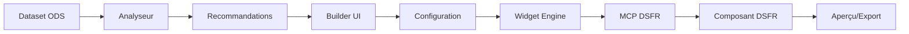

# Architecture du Projet Widget Builder DSFR-ODS

## Vision Globale

### Objectif Principal
Créer un **framework modulaire** permettant de transformer automatiquement des widgets OpenDataSoft (ODS) en composants conformes au Design System France (DSFR), avec un builder interactif et des serveurs MCP pour l'automatisation.

### Problématiques à Résoudre
1. **Portage ODS → DSFR** : Conversion automatique des widgets ODS vers les standards DSFR
2. **Modularité** : Composants réutilisables sur n'importe quel dataset
3. **Builder Interactif** : Interface pour créer/configurer des widgets sans coder
4. **Intégration MCP** : Utilisation de serveurs MCP pour automatiser les transformations

## Architecture Proposée

```
widget-builder-dsfr/
│
├── 📁 src/                         # Code source principal
│   ├── 📁 core/                    # Noyau du système
│   │   ├── 📄 widget-engine.ts     # Moteur de transformation ODS→DSFR
│   │   ├── 📄 dataset-analyzer.ts  # Analyseur de datasets
│   │   ├── 📄 config-manager.ts    # Gestionnaire de configuration
│   │   └── 📄 mcp-bridge.ts        # Interface avec les serveurs MCP
│   │
│   ├── 📁 widgets/                 # Bibliothèque de widgets
│   │   ├── 📁 base/                # Widgets de base
│   │   │   ├── 📄 table.widget.ts
│   │   │   ├── 📄 chart.widget.ts
│   │   │   ├── 📄 map.widget.ts
│   │   │   └── 📄 kpi.widget.ts
│   │   │
│   │   ├── 📁 composite/           # Widgets composés
│   │   │   ├── 📄 dashboard.widget.ts
│   │   │   └── 📄 filter-panel.widget.ts
│   │   │
│   │   └── 📄 widget.interface.ts  # Interface commune
│   │
│   ├── 📁 builder/                 # Widget Builder UI
│   │   ├── 📄 builder.app.ts       # Application principale
│   │   ├── 📄 builder.controller.ts
│   │   ├── 📄 preview.component.ts
│   │   └── 📄 code-generator.ts
│   │
│   ├── 📁 adapters/                # Adaptateurs DSFR
│   │   ├── 📄 dsfr-adapter.ts      # Conversion ODS→DSFR
│   │   ├── 📄 style-mapper.ts      # Mapping des styles
│   │   └── 📄 component-factory.ts
│   │
│   └── 📁 services/                # Services partagés
│       ├── 📄 api.service.ts       # API OpenDataSoft
│       ├── 📄 export.service.ts    # Export CSV/JSON/Excel
│       └── 📄 storage.service.ts   # Sauvegarde locale
│
├── 📁 mcp-servers/                 # Serveurs MCP TypeScript
│   ├── 📁 dsfr-mcp/
│   │   ├── 📄 index.ts             # Serveur DSFR principal
│   │   ├── 📄 components.ts        # Générateur de composants
│   │   └── 📄 validator.ts         # Validateur RGAA
│   │
│   └── 📁 ods-mcp/
│       ├── 📄 index.ts             # Serveur ODS principal
│       ├── 📄 analyzer.ts          # Analyseur de datasets
│       └── 📄 transformer.ts       # Transformateur de widgets
│
├── 📁 templates/                   # Templates HTML
│   ├── 📄 standalone.html          # Widget autonome
│   ├── 📄 embedded.html            # Widget embarqué (Drupal)
│   └── 📄 dashboard.html           # Dashboard complet
│
├── 📁 config/                      # Configuration
│   ├── 📄 datasets.json            # Configuration des datasets
│   ├── 📄 widgets.json             # Catalogue de widgets
│   └── 📄 mcp.config.json          # Configuration MCP
│
├── 📁 dist/                        # Build de production
│   ├── 📄 widget-builder.min.js
│   ├── 📄 widget-builder.min.css
│   └── 📁 widgets/                 # Widgets pré-compilés
│
├── 📁 examples/                    # Exemples d'utilisation
│   ├── 📄 signalconso.html
│   ├── 📄 budget-vert.html
│   └── 📄 custom-dataset.html
│
├── 📁 docs/                        # Documentation
│   ├── 📄 README.md
│   ├── 📄 API.md
│   ├── 📄 WIDGETS.md
│   └── 📄 MCP-INTEGRATION.md
│
├── 📁 tests/                       # Tests
│   ├── 📁 unit/
│   ├── 📁 integration/
│   └── 📁 e2e/
│
├── 📄 package.json                 # Dépendances npm
├── 📄 tsconfig.json                # Configuration TypeScript
├── 📄 webpack.config.js            # Configuration Webpack
└── 📄 .mcp.json                    # Configuration MCP locale

```

## Stack Technique Proposée

### Frontend
- **TypeScript** : Pour un code typé et maintenable
- **Angular 1.8.2** : Compatibilité avec ODS widgets
- **DSFR 1.14.0** : Design System France
- **ODS Widgets** : Widgets OpenDataSoft

### Build & Dev
- **Webpack** : Bundling et optimisation
- **ESBuild** : Transpilation rapide TypeScript
- **Vite** : HMR pour le développement

### MCP Servers
- **Node.js** : Runtime pour les serveurs MCP
- **TypeScript** : Code typé pour les serveurs
- **Express** : API REST optionnelle

### Tests
- **Jest** : Tests unitaires
- **Cypress** : Tests E2E
- **Testing Library** : Tests composants

## Flux de Données



## Questions Clés pour l'Itération

### 1. Architecture & Scope
- **Q1.1** : Voulez-vous un système **monolithique** (tout en un) ou **micro-services** (builder, widgets, MCP séparés) ?
- **Q1.2** : Le builder doit-il être une **application web complète** ou un **outil CLI** avec interface web optionnelle ?
- **Q1.3** : Priorité sur la **génération automatique** ou le **contrôle manuel** des widgets ?

### 2. Technologies & Frameworks
- **Q2.1** : Rester sur **Angular 1.8** (compatibilité ODS) ou migrer vers **Angular moderne/React/Vue** ?
- **Q2.2** : TypeScript **obligatoire** ou JavaScript acceptable pour certaines parties ?
- **Q2.3** : Serveurs MCP en **TypeScript** ou rester en **JavaScript** ?

### 3. Fonctionnalités Prioritaires
- **Q3.1** : Quels sont les **3 widgets les plus importants** à implémenter en premier ?
- **Q3.2** : Le builder doit-il gérer **tous les datasets** ou se concentrer sur **SignalConso** d'abord ?
- **Q3.3** : Export prioritaire : **HTML standalone**, **Module npm**, ou **Code embarquable** ?

### 4. Intégration & Déploiement
- **Q4.1** : Les widgets doivent-ils fonctionner **offline** ou peuvent-ils dépendre d'APIs externes ?
- **Q4.2** : Intégration **Drupal** obligatoire ou optionnelle ?
- **Q4.3** : Hébergement prévu : **SaaS**, **on-premise**, ou **les deux** ?

### 5. MCP & Automatisation
- **Q5.1** : Les serveurs MCP doivent-ils être **autonomes** ou intégrés au builder ?
- **Q5.2** : Niveau d'automatisation souhaité : **Full auto**, **Semi-auto**, ou **Manuel avec assistance** ?
- **Q5.3** : MCP pour **génération seulement** ou aussi pour **validation/optimisation** ?

### 6. Design & UX
- **Q6.1** : Interface du builder : **No-code drag&drop**, **Low-code avec config**, ou **Code avec preview** ?
- **Q6.2** : Thème DSFR **strict** ou possibilité de **personnalisation** ?
- **Q6.3** : Mobile-first ou Desktop-first ?

### 7. Performance & Scalabilité
- **Q7.1** : Volume de données max par widget : **1K**, **10K**, **100K+** lignes ?
- **Q7.2** : Temps de génération acceptable : **<1s**, **<10s**, **>10s** ?
- **Q7.3** : Nombre de widgets simultanés sur une page : **1-5**, **5-20**, **20+** ?

## Prochaines Étapes Suggérées

1. **Répondre aux questions clés** pour affiner l'architecture
2. **Valider la stack technique** proposée
3. **Définir le MVP** (Minimum Viable Product)
4. **Créer un POC** (Proof of Concept) avec 1 widget simple
5. **Itérer** sur le feedback

## Décisions à Prendre

- [ ] Architecture globale (monolithe vs micro-services)
- [ ] Stack technique finale
- [ ] Widgets prioritaires pour le MVP
- [ ] Mode de déploiement
- [ ] Niveau d'automatisation MCP
- [ ] Type d'interface pour le builder

---

**Note** : Cette architecture est modulaire et peut être adaptée selon vos réponses. L'objectif est de créer un système évolutif, maintenable et performant.