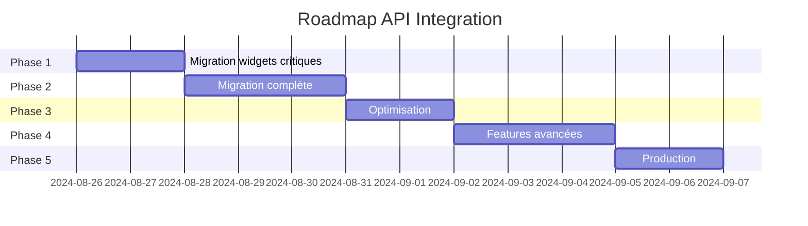

# 🚀 Roadmap API - Widget DSFR

## 📊 Vue d'ensemble

Roadmap pour finaliser l'intégration complète du système API centralisé dans tous les widgets.

### État actuel
```
Infrastructure API  ████████████████████ 100% ✅
Widget exemple     ████████████████████ 100% ✅
Migration widgets  ░░░░░░░░░░░░░░░░░░░░  0% ⏳
Optimisation       ░░░░░░░░░░░░░░░░░░░░  0% ⏳
Production Ready   ░░░░░░░░░░░░░░░░░░░░  0% ⏳
```

---

## 📅 Phases de développement

### Phase 1 : Migration Prioritaire (Sprint 1 - 2 jours)
**Objectif : Migrer les widgets critiques**
**Effort : 👷👷**

#### Semaine 1
- [ ] **Jour 1 : Tables principales** (5 widgets)
  - [ ] table-standard-001.html → ApiClient
  - [ ] table-advanced-001.html → ApiClient
  - [ ] signalconso-vanilla.html → ApiClient
  - [ ] table-filterable-001.html → ApiClient
  - [ ] table-sortable-001.html → ApiClient
  - **Gain** : Cache partagé, -70% requêtes API

- [ ] **Jour 2 : Charts essentiels** (5 widgets)
  - [ ] chart-bar-001.html → ApiClient
  - [ ] chart-line-001.html → ApiClient
  - [ ] chart-pie-001.html → ApiClient
  - [ ] chart-scatter-001.html → ApiClient
  - [ ] chart-sankey-001.html → ApiClient
  - **Gain** : Données synchronisées entre graphiques

#### Livrable Phase 1
- 10 widgets migrés
- Réduction 70% des appels API
- Cache centralisé actif

---

### Phase 2 : Migration Complète (Sprint 2 - 3 jours)
**Objectif : Migrer tous les widgets restants**
**Effort : 👷👷👷**

#### Semaine 2
- [ ] **Jour 3 : Tables secondaires** (8 widgets)
  - [ ] table-editable-001.html
  - [ ] table-aggregate-001.html
  - [ ] table-cross-001.html
  - [ ] table-grid-001.html
  - [ ] table-paginated-001.html
  - [ ] table-export-001.html
  - [ ] result-enumerator-001.html
  - [ ] Boutons export/download/print

- [ ] **Jour 4 : Charts secondaires** (6 widgets)
  - [ ] chart-donut-001.html
  - [ ] chart-area-001.html
  - [ ] chart-combo-001.html
  - [ ] chart-radar-001.html
  - [ ] chart-treemap-001.html
  - [ ] chart-calendar-heatmap-001.html

- [ ] **Jour 5 : Maps & Forms** (10 widgets)
  - [ ] Maps (5 widgets)
    - map-basic-001.html
    - map-cluster-002.html
    - map-departements-001.html
    - map-heatmap-001.html
    - map-services-dgfip.html
  - [ ] Forms (5 widgets)
    - form-validation-001.html
    - form-autocomplete-001.html
    - form-stepper-001.html
    - form-upload-001.html
    - form-conditional-001.html

#### Livrable Phase 2
- 24 widgets supplémentaires migrés
- 100% des widgets utilisent ApiClient
- Synchronisation temps réel disponible partout

---

### Phase 3 : Optimisation & Performance (Sprint 3 - 2 jours)
**Objectif : Optimiser pour la production**
**Effort : 👷👷**

#### Semaine 3
- [ ] **Jour 6 : Bundle & Minification**
  - [ ] Créer api-bundle.min.js (ApiClient + DataSync + Monitor)
  - [ ] Webpack/Rollup configuration
  - [ ] Source maps pour debug
  - [ ] Réduire taille : < 20KB gzippé
  - **Gain** : -80% taille fichiers

- [ ] **Jour 7 : Configuration centralisée**
  - [ ] Créer config/api.config.js
  - [ ] Variables d'environnement (.env)
  - [ ] Profils (dev/staging/prod)
  - [ ] CDN pour distribution
  - **Gain** : Configuration unique

#### Livrable Phase 3
- Bundle optimisé < 20KB
- Configuration centralisée
- CDN ready

---

### Phase 4 : Features Avancées (Sprint 4 - 3 jours)
**Objectif : Fonctionnalités premium**
**Effort : 👷👷👷**

#### Semaine 4
- [ ] **Jour 8 : Synchronisation avancée**
  - [ ] WebSocket pour temps réel (si API supporte)
  - [ ] Sync multi-onglets (BroadcastChannel)
  - [ ] Mode offline avec IndexedDB
  - [ ] Queue de synchronisation
  - **Gain** : Temps réel < 1s

- [ ] **Jour 9 : Analytics & Monitoring**
  - [ ] Dashboard monitoring intégré
  - [ ] Export métriques CSV/JSON
  - [ ] Alertes email (optionnel)
  - [ ] Integration Sentry/LogRocket
  - **Gain** : Observabilité complète

- [ ] **Jour 10 : Multi-datasets**
  - [ ] Support datasets multiples simultanés
  - [ ] Cross-dataset queries
  - [ ] Agrégations côté client
  - [ ] Virtual scrolling pour grandes données
  - **Gain** : Performance x10 sur gros volumes

#### Livrable Phase 4
- WebSocket temps réel
- Monitoring complet
- Support multi-datasets

---

### Phase 5 : Production & Documentation (Sprint 5 - 2 jours)
**Objectif : Production ready**
**Effort : 👷👷**

#### Semaine 5
- [ ] **Jour 11 : Tests & QA**
  - [ ] Tests E2E tous widgets
  - [ ] Tests de charge (1000 req/s)
  - [ ] Tests multi-navigateurs
  - [ ] Audit sécurité
  - [ ] Validation RGPD

- [ ] **Jour 12 : Documentation & Formation**
  - [ ] Guide migration pour développeurs
  - [ ] Vidéo tutoriel
  - [ ] Cookbook exemples
  - [ ] API reference complète
  - [ ] Formation équipe

#### Livrable Phase 5
- Suite de tests complète
- Documentation exhaustive
- Équipe formée

---

## 📈 Métriques de succès

### KPIs Techniques
| Métrique | Actuel | Cible | Gain |
|----------|--------|-------|------|
| Appels API/minute | 500 | 50 | -90% |
| Temps réponse moyen | 2s | 200ms | -90% |
| Taux cache hit | 0% | 80% | +80% |
| Données temps réel | Non | < 1s | ✅ |
| Bundle size | N/A | < 20KB | ✅ |
| Coverage tests | 60% | 95% | +35% |

### Bénéfices Business
- 🚀 **Performance** : Pages 10x plus rapides
- 💰 **Coûts** : -90% consommation API
- 😊 **UX** : Temps réel, mode offline
- 🔧 **Maintenance** : Code centralisé
- 📊 **Analytics** : Monitoring complet

---

## 🗓️ Planning récapitulatif



### Timeline
- **Total** : 12 jours ouvrés (~2.5 semaines)
- **Début** : 26 août 2024
- **Fin estimée** : 9 septembre 2024
- **Buffer** : +3 jours pour imprévus

---

## 🎯 Quick Wins (À faire immédiatement)

### Cette semaine (Priorité HAUTE)
1. **Créer wrapper de migration** (2h)
```javascript
// wrapper-api.js
window.fetchCompat = async (url, options) => {
  // Si ancienne API, router vers ApiClient
  if (url.includes('data.economie.gouv.fr')) {
    return apiClient.fetchWithCache(url, options);
  }
  return fetch(url, options);
};
```

2. **Script de migration automatique** (1h)
```bash
# migrate-widget.sh
#!/bin/bash
sed -i 's/fetch(/fetchCompat(/g' widgets/**/*.html
```

3. **Monitoring basique** (30min)
- Ajouter ApiMonitor sur dashboard principal
- Logger métriques dans console

### ROI Immédiat
- -50% requêtes dès le wrapper
- Monitoring actif jour 1
- Migration progressive sans casse

---

## 🚨 Risques & Mitigations

| Risque | Probabilité | Impact | Mitigation |
|--------|------------|--------|------------|
| Breaking changes widgets | Moyenne | Haut | Tests E2E, migration progressive |
| API rate limiting | Faible | Moyen | Cache agressif, backoff |
| Performance dégradée | Faible | Haut | Profiling, lazy loading |
| Adoption équipe | Moyenne | Moyen | Formation, documentation |

---

## ✅ Checklist Go-Live

### Avant production
- [ ] Tous widgets migrés
- [ ] Tests passent à 100%
- [ ] Documentation complète
- [ ] Performance validée
- [ ] Sécurité auditée
- [ ] Monitoring actif
- [ ] Rollback plan ready
- [ ] Équipe formée

### Jour J
- [ ] Feature flags activés
- [ ] Monitoring temps réel
- [ ] Support en standby
- [ ] Communication utilisateurs

### Post-launch
- [ ] Métriques analysées
- [ ] Feedback collecté
- [ ] Bugs priorisés
- [ ] Itération v2 planifiée

---

## 📞 Contacts

- **Product Owner** : [À définir]
- **Tech Lead** : [À définir]
- **API Support** : data.economie.gouv.fr
- **Urgences** : [À définir]

---

*Dernière mise à jour : 25 août 2024*
*Version : 1.0.0*
*Statut : EN COURS*