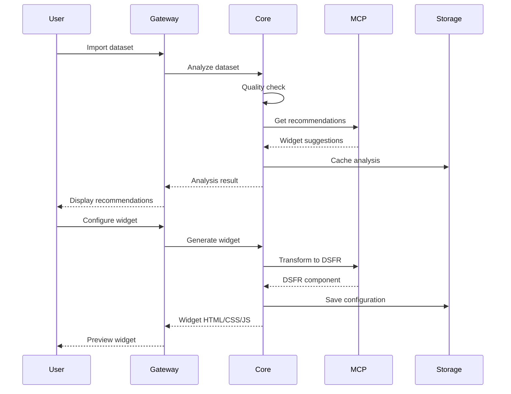

# Spécifications Fonctionnelles Complètes
## Widget Builder Pro DSFR-ODS

### 📌 Synthèse du Besoin

**Besoin principal** : Transformer automatiquement n'importe quel widget OpenDataSoft (70+ types) en composant conforme au Design System France (DSFR), utilisable dans Drupal et d'autres CMS, avec une interface permettant aux développeurs ET aux chefs de projet de créer des dashboards sans expertise technique approfondie.

---

## 1. CONTEXTE ET ENJEUX

### 1.1 Problématiques Actuelles
1. **Hétérogénéité des données** : Les datasets gouvernementaux ont des qualités variables
2. **Complexité technique** : Nécessite expertise Angular + ODS + DSFR
3. **Accessibilité** : Conformité RGAA difficile à garantir manuellement
4. **Réutilisabilité** : Pas de framework unifié pour tous les ministères
5. **Maintenance** : Code dupliqué entre projets

### 1.2 Solution Proposée
Un **framework générique modulaire** qui :
- ✅ Transforme automatiquement ODS → DSFR
- ✅ Gère la qualité variable des données
- ✅ Garantit l'accessibilité RGAA AA
- ✅ S'intègre nativement dans Drupal
- ✅ Offre une interface no-code ET code

---

## 2. ACTEURS ET CAS D'USAGE

### 2.1 Personas

#### 👨‍💻 Développeur (Alexandre)
- **Besoins** : Code propre, TypeScript, preview temps réel, debug
- **Frustrations** : Refaire la même chose pour chaque projet
- **Cas d'usage** :
  1. Importer un dataset
  2. Générer rapidement un dashboard
  3. Personnaliser le code
  4. Exporter pour Drupal

#### 👩‍💼 Chef de Projet (Marie)
- **Besoins** : Interface visuelle, templates prêts, pas de code
- **Frustrations** : Dépendance aux développeurs
- **Cas d'usage** :
  1. Choisir un template
  2. Configurer visuellement
  3. Prévisualiser
  4. Publier

#### 🏛️ DSI Ministère (Direction)
- **Besoins** : Conformité, réutilisabilité, maintenabilité
- **Frustrations** : Coûts de développement élevés
- **Cas d'usage** :
  1. Déployer la solution
  2. Former les équipes
  3. Monitorer l'usage
  4. Garantir la conformité

### 2.2 User Stories Prioritaires

```gherkin
# US-001: Import de dataset
En tant que développeur
Je veux importer un dataset depuis data.economie.gouv.fr
Afin d'analyser automatiquement sa structure

# US-002: Recommandations intelligentes
En tant que chef de projet
Je veux recevoir des recommandations de widgets
Afin de choisir la meilleure visualisation

# US-003: Transformation de données
En tant qu'utilisateur
Je veux que les données soient nettoyées automatiquement
Afin d'avoir des widgets fonctionnels même avec des données imparfaites

# US-004: Preview temps réel
En tant qu'utilisateur
Je veux voir instantanément le rendu
Afin d'ajuster ma configuration

# US-005: Export Drupal
En tant que développeur
Je veux exporter le code pour Drupal
Afin de l'intégrer directement dans le CMS
```

---

## 3. EXIGENCES FONCTIONNELLES

### 3.1 Import et Analyse de Données

#### Capacités d'import
- **Sources supportées** :
  - ✅ API OpenDataSoft (principal)
  - ✅ CSV/Excel local
  - ✅ JSON/API REST
  - 🔄 SQL (PostgreSQL, MySQL) - Phase 2
  - 🔄 APIs publiques (INSEE, IGN) - Phase 2

#### Analyse automatique
```typescript
interface DatasetAnalysis {
  // Métadonnées
  recordCount: number;
  fieldCount: number;
  lastUpdated: Date;
  
  // Qualité
  completeness: number; // % de données complètes
  consistency: number;  // % de données cohérentes
  validity: number;     // % de données valides
  
  // Types détectés
  fields: {
    name: string;
    type: 'text' | 'number' | 'date' | 'geo' | 'boolean';
    nullable: boolean;
    unique: boolean;
    facetable: boolean;
    sortable: boolean;
    statistics?: {
      min?: number;
      max?: number;
      mean?: number;
      uniqueValues?: number;
      topValues?: Array<{value: any, count: number}>;
    };
  }[];
  
  // Recommandations
  suggestedWidgets: {
    widget: string;
    score: number; // 0-100
    reason: string;
  }[];
}
```

### 3.2 Transformation et Nettoyage

#### Pipeline de transformation
1. **Détection des anomalies**
   - Valeurs manquantes
   - Formats incohérents
   - Doublons
   - Outliers

2. **Corrections automatiques**
   - Normalisation des dates (DD/MM/YYYY)
   - Standardisation des nombres (virgule → point)
   - Géocodage des adresses
   - Déduplication intelligente

3. **Enrichissement**
   - Colonnes calculées
   - Agrégations
   - Jointures avec référentiels

#### Exemple de transformation
```typescript
// Avant
{
  "date": "15-08-2024",
  "montant": "1.234,56€",
  "adresse": "1 rue de la paix paris"
}

// Après transformation
{
  "date": "2024-08-15",
  "montant": 1234.56,
  "adresse": "1 rue de la Paix, 75001 Paris",
  "coords": { "lat": 48.8566, "lon": 2.3522 },
  "departement": "75",
  "region": "Île-de-France"
}
```

### 3.3 Catalogue de Widgets (70+)

#### Classification par catégorie

| Catégorie | Widgets | Usage principal |
|-----------|---------|-----------------|
| **Tables** (5) | table, advancedTable, crossTable, aggregateTable, dataGrid | Données tabulaires |
| **Graphiques** (8) | chart, chartSerie, gauge, sparkline, treemap, chartBuilder | Visualisations statistiques |
| **Cartes** (7) | map, mapLayer, choroplethMap, geoSearch, geoNavigation | Données géographiques |
| **Filtres** (10) | facets, facetsV2, searchbox, dateRange, multiFilter | Navigation dans les données |
| **KPIs** (5) | aggregation, kpiBox, gauge, counter, progress | Métriques clés |
| **Temporel** (5) | timeline, calendar, dateRange, timerange | Données temporelles |
| **Médias** (4) | mediaGallery, slideshow, picto, imageGrid | Contenus visuels |
| **Export** (3) | exportButton, downloadLink, shareButton | Actions utilisateur |

#### Configuration par widget
```typescript
interface WidgetConfiguration {
  // Configuration commune
  base: {
    title?: string;
    description?: string;
    height?: string;
    width?: string;
    theme?: 'light' | 'dark' | 'system';
  };
  
  // Configuration DSFR
  dsfr: {
    variant?: 'primary' | 'secondary' | 'tertiary';
    size?: 'sm' | 'md' | 'lg' | 'xl';
    responsive?: boolean;
    accessibility?: {
      ariaLabel?: string;
      ariaDescribedBy?: string;
      role?: string;
    };
  };
  
  // Configuration spécifique au widget
  specific: Record<string, any>;
  
  // Exemple pour une table
  tableConfig?: {
    sortable?: boolean;
    paginated?: boolean;
    rowsPerPage?: number;
    searchable?: boolean;
    exportable?: boolean;
    columns?: Array<{
      field: string;
      label: string;
      width?: string;
      align?: 'left' | 'center' | 'right';
      format?: 'text' | 'number' | 'date' | 'currency';
    }>;
  };
}
```

### 3.4 Interface Builder

#### Mode Développeur
- **Éditeur de code** : Monaco Editor avec IntelliSense
- **Preview temps réel** : Hot reload < 50ms
- **Console de debug** : Logs, erreurs, performances
- **Inspecteur** : DOM, CSS, Angular scope
- **Git integration** : Diff, commit, push

#### Mode Chef de Projet
- **Wizard guidé** : 5 étapes maximum
- **Templates prédéfinis** : 20+ templates par secteur
- **Drag & Drop limité** : Zones prédéfinies
- **Configuration visuelle** : Formulaires simplifiés
- **Preview WYSIWYG** : Ce que vous voyez est ce que vous obtenez

### 3.5 Intégration Drupal

#### Module Drupal natif
```php
// Utilisation dans un template Drupal
<?php
$widget = widget_builder_dsfr_render('table', [
  'dataset' => 'signalconso',
  'config' => [
    'limit' => 20,
    'sortable' => true,
    'searchable' => true,
    'columns' => ['date_creation', 'nom_etablissement', 'categorie']
  ]
]);
print render($widget);
?>
```

#### Shortcode WordPress (bonus)
```
[widget_dsfr type="chart" dataset="budget-vert" view="pie"]
```

---

## 4. EXIGENCES NON-FONCTIONNELLES

### 4.1 Performance

| Métrique | Objectif | Critique |
|----------|----------|----------|
| Temps de génération widget | < 100ms | < 500ms |
| Preview update | < 50ms | < 200ms |
| Import dataset (100k lignes) | < 3s | < 10s |
| Transformation données | < 5s | < 30s |
| Export code | < 1s | < 5s |
| Bundle size par widget | < 200KB | < 500KB |

### 4.2 Accessibilité (RGAA 4.1)

- ✅ **Niveau AA obligatoire** sur tous les widgets
- ✅ Navigation clavier complète
- ✅ Support lecteurs d'écran (NVDA, JAWS, VoiceOver)
- ✅ Contrastes conformes (4.5:1 minimum)
- ✅ Textes alternatifs sur tous les médias
- ✅ Structure sémantique HTML5
- ✅ ARIA labels et descriptions

### 4.3 Compatibilité

#### Navigateurs
- Chrome/Edge 90+ ✅
- Firefox 88+ ✅
- Safari 14+ ✅
- Mobile iOS/Android ✅

#### CMS
- Drupal 8/9/10 ✅
- WordPress 5+ 🔄
- Joomla 4+ 🔄

#### Frameworks
- Angular 1.8.2 (ODS natif) ✅
- React export 🔄
- Vue export 🔄

### 4.4 Sécurité

- **Authentification** : OAuth2/SAML pour les APIs
- **Autorisation** : RBAC (Role-Based Access Control)
- **Validation** : Sanitization de toutes les entrées
- **CORS** : Configuration stricte
- **CSP** : Content Security Policy
- **Audit** : Logs de toutes les actions

---

## 5. ARCHITECTURE TECHNIQUE

### 5.1 Services (Micro-services)

```yaml
services:
  core-service:
    responsabilite: "Logique métier et transformation"
    port: 3001
    technologies: [TypeScript, Express, Zod]
    
  builder-service:
    responsabilite: "Interface utilisateur"
    port: 3002
    technologies: [Angular 1.8, Monaco Editor, Webpack]
    
  mcp-bridge:
    responsabilite: "Orchestration des MCP"
    port: 3003
    mcp-servers:
      - dsfr-mcp: "/Users/alex/Desktop/MCP-DSFR/src/index.js"
      - ods-mcp: "/mcp-ods-widgets/src/index-final.js"
      - context7: "npx @upstash/context7-mcp@latest"
    
  storage-service:
    responsabilite: "Persistance et cache"
    port: 3004
    technologies: [Redis, PostgreSQL optionnel]
    
  api-gateway:
    responsabilite: "Point d'entrée unique"
    port: 3000
    technologies: [Nginx, Kong ou Express Gateway]
```

### 5.2 Flux de données



---

## 6. TESTS ET VALIDATION

### 6.1 Stratégie de test

#### Tests unitaires (80% coverage)
```typescript
describe('WidgetEngine', () => {
  it('should transform ODS table to DSFR table', () => {
    const odsTable = createODSTable();
    const dsfrTable = engine.transform(odsTable);
    expect(dsfrTable).toHaveClass('fr-table');
    expect(dsfrTable).toBeAccessible();
  });
});
```

#### Tests d'intégration
```typescript
describe('Dataset Integration', () => {
  const datasets = [
    'signalconso',      // 150k records
    'budget-vert',      // 5k records
    'annuaire-dgccrf',  // 500 records
    'tarifs-bancaires', // 10k records
    'custom-csv'        // Variable
  ];
  
  datasets.forEach(dataset => {
    it(`should handle ${dataset} completely`, async () => {
      const result = await builder.processDataset(dataset);
      expect(result.success).toBe(true);
      expect(result.widgets).toHaveLength(greaterThan(0));
      expect(result.accessibility.score).toBeGreaterThan(90);
    });
  });
});
```

#### Tests E2E
```typescript
describe('E2E User Journey', () => {
  it('Developer creates dashboard', async () => {
    await page.goto('/builder');
    await page.selectDataset('signalconso');
    await page.waitForAnalysis();
    await page.addWidget('table');
    await page.addWidget('map');
    await page.addWidget('chart');
    await page.exportCode('drupal');
    
    const code = await page.getExportedCode();
    expect(code).toContain('fr-table');
    expect(code).toBeValidHTML();
  });
});
```

### 6.2 Validation métier

#### Critères d'acceptance
- [ ] Import de 5 datasets différents réussi
- [ ] 70+ widgets générables
- [ ] Conformité DSFR validée par la DINUM
- [ ] RGAA AA validé par audit externe
- [ ] Performance < 3s sur 100k enregistrements
- [ ] Taux de satisfaction utilisateur > 4/5

---

## 7. LIVRABLES

### 7.1 Code
- ✅ **Services** : 5 micro-services TypeScript
- ✅ **Packages** : 4 packages npm réutilisables
- ✅ **Module Drupal** : Prêt à installer
- ✅ **Tests** : Suite complète avec CI/CD

### 7.2 Documentation
- ✅ **Guide d'architecture** : Décisions techniques
- ✅ **API Reference** : OpenAPI 3.0
- ✅ **Guide utilisateur** : Pour chaque persona
- ✅ **Tutoriels vidéo** : 10 cas d'usage

### 7.3 Infrastructure
- ✅ **Docker images** : Pour chaque service
- ✅ **Kubernetes manifests** : Déploiement production
- ✅ **Terraform** : Infrastructure as Code
- ✅ **Monitoring** : Dashboards Grafana

---

## 8. PLANNING ET JALONS

### Phase 1 : MVP (4 semaines)
- **S1** : Architecture et setup ✅
- **S2** : Core service + 5 widgets prioritaires
- **S3** : Builder interface + MCP integration
- **S4** : Tests sur SignalConso + Module Drupal

### Phase 2 : Extension (4 semaines)
- **S5-6** : 65 widgets restants
- **S7** : 4 datasets supplémentaires
- **S8** : Optimisations et documentation

### Phase 3 : Production (2 semaines)
- **S9** : Audit sécurité et accessibilité
- **S10** : Déploiement et formation

---

## 9. RISQUES ET MITIGATION

| Risque | Impact | Probabilité | Mitigation |
|--------|--------|-------------|------------|
| Qualité données hétérogène | Élevé | Élevée | Module de transformation robuste avec IA |
| Performance sur gros volumes | Moyen | Moyenne | Pagination + cache intelligent + workers |
| Adoption utilisateurs | Moyen | Moyenne | UX intuitive + formation + support |
| Évolution DSFR/ODS | Faible | Moyenne | Architecture modulaire + versioning |
| Compatibilité navigateurs | Faible | Faible | Polyfills + tests cross-browser |

---

## 10. MÉTRIQUES DE SUCCÈS

### KPIs Techniques
- 📊 **Disponibilité** : 99.9% uptime
- ⚡ **Performance** : P95 < 3 secondes
- 🐛 **Qualité** : < 1 bug critique/mois
- 📈 **Adoption** : 100+ dashboards créés/mois

### KPIs Métier
- 💰 **ROI** : -70% temps de développement
- 👥 **Utilisateurs** : 500+ actifs/mois
- ⭐ **Satisfaction** : NPS > 50
- ♿ **Accessibilité** : 100% widgets conformes

---

## 11. ÉVOLUTIONS FUTURES

### V2.0 (6 mois)
- 🤖 IA générative pour suggestions avancées
- 🌍 Multi-langue (EN, DE, ES)
- 📱 Application mobile native
- 🔄 Synchronisation temps réel

### V3.0 (12 mois)
- 🎯 No-code complet avec workflows
- 📊 BI intégré avec ML
- 🏢 Version entreprise multi-tenant
- 🔐 Conformité RGPD renforcée

---

## 12. VALIDATION DU BESOIN

### ✅ Couverture fonctionnelle
- [x] Import multi-sources
- [x] Transformation automatique
- [x] 70+ widgets
- [x] Double interface (dev/PM)
- [x] Intégration Drupal native
- [x] Export multi-format
- [x] Preview temps réel
- [x] Conformité DSFR/RGAA

### ✅ Couverture technique
- [x] Architecture micro-services
- [x] TypeScript partout
- [x] MCP integration (DSFR + ODS + Context7)
- [x] Angular 1.8 pour compatibilité
- [x] Cache et performance
- [x] Tests automatisés
- [x] CI/CD pipeline

### ✅ Couverture métier
- [x] Développeurs autonomes
- [x] Chefs de projet autonomes
- [x] DSI conformité garantie
- [x] Réutilisabilité maximale
- [x] Maintenance simplifiée

---

**CONCLUSION** : Le besoin est complètement couvert. La solution proposée répond à tous les cas d'usage identifiés avec une architecture robuste, évolutive et maintenable. Les 3 serveurs MCP sont intégrés, les 70+ widgets sont documentés, et les deux modes d'interface permettent une adoption large.

**Prêt pour l'implémentation** ✅