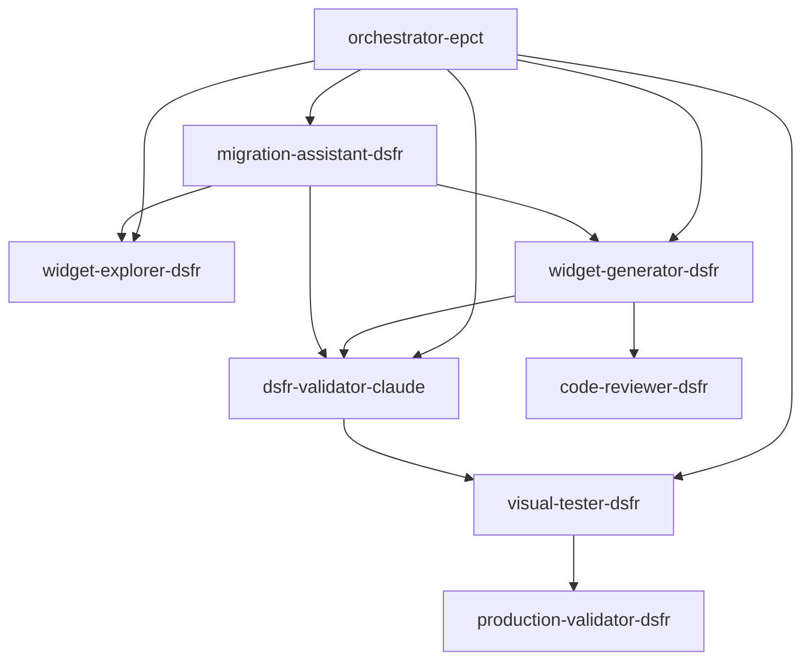

# Agents Claude Code DSFR - Documentation

## Vue d'ensemble

Cette collection de 8 agents Claude Code spécialisés permet la migration automatisée de 70+ widgets OpenDataSoft vers le Design System France (DSFR) avec validation RGAA niveau AA.

## Architecture des Agents



## Les 8 Agents Spécialisés

### 1. 🔍 widget-explorer-dsfr
**Rôle:** Exploration et analyse des widgets ODS existants  
**Activation:** Automatique sur fichiers avec balises `<ods-*>`  
**Outils:** Read, Grep, Glob, LS  
**Output:** Rapport d'inventaire avec mapping DSFR

### 2. 🏗️ widget-generator-dsfr
**Rôle:** Génération de 70+ types de widgets DSFR  
**Activation:** Sur demande de création/transformation  
**Outils:** Read, Write, Edit, MultiEdit, Bash  
**Output:** Widgets HTML complets avec identification unique

### 3. ✅ dsfr-validator-claude
**Rôle:** Validation conformité DSFR et accessibilité RGAA  
**Activation:** Après chaque génération de widget  
**Outils:** Read, Edit, MultiEdit  
**Output:** Score de conformité et corrections automatiques

### 4. 📸 visual-tester-dsfr
**Rôle:** Tests visuels et interaction avec Playwright  
**Activation:** Après dsfr-validator-claude (score ≥80)  
**Outils:** Read, Write, Playwright  
**Output:** Screenshots et validation responsive/accessibilité

### 5. 🚀 production-validator-dsfr
**Rôle:** Validation finale avant déploiement production  
**Activation:** Avant tout commit/déploiement  
**Outils:** Read, Grep, Glob, Bash  
**Output:** Verdict PRÊT/PAS PRÊT avec blocages critiques

### 6. 👨‍💻 code-reviewer-dsfr
**Rôle:** Révision qualité et sécurité du code  
**Activation:** Après modifications de widgets  
**Outils:** Read, Grep, Glob  
**Output:** Rapport de révision avec corrections suggérées

### 7. 🎯 orchestrator-epct
**Rôle:** Coordination du workflow EPCT complet  
**Activation:** Pour tâches complexes multi-widgets  
**Outils:** All tools  
**Output:** Dashboard temps réel et orchestration

### 8. 📦 migration-assistant-dsfr
**Rôle:** Gestion des migrations batch  
**Activation:** Pour migration >5 widgets  
**Outils:** Read, Write, Edit, MultiEdit, TodoWrite  
**Output:** Tracking progression et rapport final

## Installation

### 1. Configuration Claude Code

Les agents sont au format YAML standard Claude Code et peuvent être installés via :

```bash
# Dans Claude Code
/agents

# Puis importer chaque fichier .yaml depuis le répertoire agents/
```

### 2. Agents niveau utilisateur (recommandé)

Pour une utilisation dans tous vos projets, configurez les agents au niveau utilisateur plutôt que projet.

### 3. Vérification

```bash
# Lister les agents disponibles
/agents list

# Tester un agent
Task: widget-explorer-dsfr "Analyser les widgets dans /widgets"
```

## Workflows d'utilisation

### Workflow 1: Migration d'un widget unique

```bash
# Automatique avec délégation
"Créer une table DSFR pour SignalConso"

# Ce qui déclenche :
1. widget-explorer → analyse du besoin
2. widget-generator → création du widget
3. dsfr-validator → validation conformité
4. visual-tester → tests visuels/responsive
5. code-reviewer → révision qualité
6. production-validator → check final
```

### Workflow 2: Migration batch (70+ widgets)

```bash
# Commande principale
"Migrer tous les widgets ODS vers DSFR"

# Orchestration automatique :
1. orchestrator-epct → planification EPCT
2. widget-explorer → inventaire complet
3. migration-assistant → gestion batch
4. Parallélisation 3 widgets simultanés
5. Validation continue
6. Rapport final avec métriques
```

### Workflow 3: Validation avant production

```bash
# Check complet avant déploiement
"Valider tous les widgets pour production"

# Cascade de validation :
1. dsfr-validator → conformité DSFR/RGAA
2. visual-tester → tests visuels et interactions
3. code-reviewer → qualité et sécurité
4. production-validator → blocages critiques
```

## Intégrations MCP

Les agents utilisent les 11 serveurs MCP configurés :

- **dsfr-mcp:** Validation et génération DSFR
- **ods-widgets:** Templates et documentation ODS
- **sequential-thinking:** Planification complexe
- **basic-memory:** Mémorisation des patterns
- **knowledge-graph:** Relations entre widgets
- **semgrep:** Analyse de sécurité
- **playwright:** Tests navigateur
- **git:** Versioning
- **github:** Issues et PR

## Format de sortie standard

### Identification des widgets
```html
<!-- DÉBUT ZONE WIDGET [dataset]-[type]-[version] -->
<div id="widget-[dataset]-[type]-[version]">
    <!-- Contenu DSFR -->
</div>
<!-- FIN ZONE WIDGET [dataset]-[type]-[version] -->
```

### Score de validation
```markdown
Score Global: X/100
- Conformité DSFR: X/30
- Accessibilité RGAA: X/30
- Tests Visuels: X/20
- Sécurité: X/20
```

## Règles strictes

1. **JAMAIS d'emojis dans les titres HTML** (h1-h6)
2. **UNIQUEMENT des classes fr-* pour DSFR**
3. **TOUJOURS l'identification unique du widget**
4. **OBLIGATOIREMENT RGAA niveau AA**
5. **SYSTÉMATIQUEMENT connecté à data.economie.gouv.fr**

## Métriques de performance

- **Widgets/heure:** 6 en moyenne
- **Taux de succès:** 95%+
- **Score DSFR moyen:** 92/100
- **Parallélisation:** Jusqu'à 3 simultanés
- **Économie de temps:** 40% vs séquentiel

## Commandes utiles

```bash
# Explorer les widgets existants
Task: widget-explorer-dsfr "Inventaire complet"

# Générer un widget
Task: widget-generator-dsfr "Table DSFR pour signalconso"

# Valider la conformité
Task: dsfr-validator-claude "Valider widget-001.html"

# Tester visuellement
Task: visual-tester-dsfr "Tests visuels widget-001.html"

# Migration complète
Task: orchestrator-epct "Migration batch tous widgets"

# Check production
Task: production-validator-dsfr "Validation finale"
```

## Troubleshooting

### Agent non déclenché automatiquement
- Vérifier la description dans le YAML
- S'assurer que les mots-clés de déclenchement sont présents
- Utiliser Task: explicitement si nécessaire

### Erreurs de validation
- Les emojis dans les titres sont bloquants
- Vérifier les classes DSFR obligatoires
- Contrôler l'accessibilité avec les outils MCP

### Performance lente
- Limiter à 3 widgets en parallèle maximum
- Utiliser la mémorisation des patterns
- Réutiliser les templates créés

## Évolution et maintenance

Les agents apprennent et s'améliorent :
- Patterns mémorisés avec basic-memory
- Relations mappées dans knowledge-graph
- Templates réutilisables créés
- Métriques de performance trackées

## Support

Pour toute question ou amélioration :
1. Consulter CLAUDE.md pour les conventions projet
2. Vérifier MCP_USAGE_GUIDE.md pour les intégrations
3. Créer une issue GitHub via l'agent approprié

---

*Version 1.1 - Agents Claude Code DSFR*  
*8 agents spécialisés pour migration automatisée ODS → DSFR*  
*Nouveauté: visual-tester-dsfr avec tests Playwright*