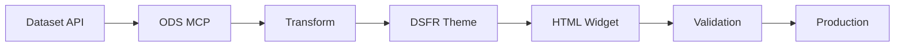
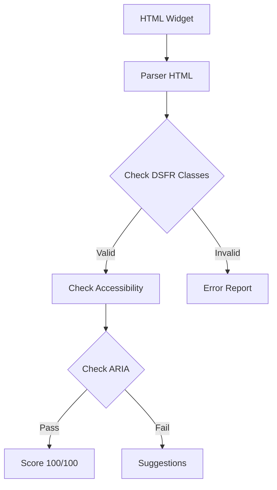

# Architecture du Projet Widget DSFR

## Vue d'ensemble

Le projet Widget DSFR est une solution complète pour transformer les widgets OpenDataSoft en composants conformes au Design System France (DSFR).

## Architecture Technique

```
┌─────────────────────────────────────────────────────────────┐
│                         Frontend                             │
│  ┌─────────────┐  ┌──────────────┐  ┌──────────────┐       │
│  │   Widgets   │  │   Examples   │  │    Tests     │       │
│  │  HTML/DSFR  │  │  Dashboards  │  │   E2E/Unit   │       │
│  └─────────────┘  └──────────────┘  └──────────────┘       │
└─────────────────────────────────────────────────────────────┘
                              │
┌─────────────────────────────────────────────────────────────┐
│                      MCP Servers                             │
│  ┌──────────────┐  ┌──────────────┐  ┌──────────────┐      │
│  │  DSFR MCP    │  │   ODS MCP    │  │   Autres     │      │
│  │  Validation  │  │  Transform   │  │   MCPs       │      │
│  └──────────────┘  └──────────────┘  └──────────────┘      │
└─────────────────────────────────────────────────────────────┘
                              │
┌─────────────────────────────────────────────────────────────┐
│                      Data Sources                            │
│  ┌──────────────────────────────────────────────────┐       │
│  │         data.economie.gouv.fr API                │       │
│  │  (SignalConso, DGCCRF, Budget, etc.)            │       │
│  └──────────────────────────────────────────────────┘       │
└─────────────────────────────────────────────────────────────┘
```

## Composants Principaux

### 1. Widgets (`/widgets`)

Structure modulaire des widgets par type :

```
widgets/
├── tables/          # Widgets tableaux
├── charts/          # Widgets graphiques
├── maps/            # Widgets cartes
├── facets/          # Widgets facettes
└── forms/           # Widgets formulaires
```

### 2. Serveurs MCP

#### DSFR MCP (`/mcp-dsfr`)
- Génération de composants DSFR
- Validation de conformité
- Analyse d'accessibilité RGAA

#### ODS MCP (`/mcp-ods-widgets`)
- Transformation des widgets ODS
- Adaptation au thème DSFR
- Analyse des datasets

### 3. Tests (`/tests`)

```
tests/
├── run-tests.js        # Orchestrateur de tests
├── validate-dsfr.js    # Validation DSFR
├── e2e/               # Tests End-to-End Playwright
└── unit/              # Tests unitaires (à venir)
```

### 4. Agents (`/agents`)

Agents d'automatisation au format YAML Claude Code :
- `widget-explorer`: Analyse du codebase
- `widget-generator`: Génération de widgets
- `dsfr-validator`: Validation de conformité
- `migration-assistant`: Migration batch

## Flux de Données

### 1. Génération de Widget



### 2. Validation DSFR



## Patterns de Code

### Pattern Widget

```javascript
// Structure standard d'un widget
class Widget {
  constructor(type, dataset, options) {
    this.type = type;
    this.dataset = dataset;
    this.options = options;
  }
  
  async render() {
    const data = await this.fetchData();
    const html = this.generateHTML(data);
    return this.applyDSFRTheme(html);
  }
}
```

### Pattern MCP Service

```javascript
// Service MCP standard
class MCPService {
  async handle(method, params) {
    switch(method) {
      case 'create_widget':
        return this.createWidget(params);
      case 'validate':
        return this.validate(params);
    }
  }
}
```

### Pattern Validation

```javascript
// Validation en pipeline
const validate = async (html) => {
  const results = [];
  
  // Étape 1: Structure HTML
  results.push(await validateHTML(html));
  
  // Étape 2: Classes DSFR
  results.push(await validateDSFR(html));
  
  // Étape 3: Accessibilité
  results.push(await validateA11y(html));
  
  return computeScore(results);
};
```

## Configuration

### package.json Scripts

```json
{
  "scripts": {
    "dev": "Live development server",
    "build": "Production build",
    "test": "Run tests",
    "validate": "DSFR validation",
    "lint": "Code linting",
    "format": "Code formatting"
  }
}
```

### Variables d'Environnement

```bash
# API Configuration
API_BASE_URL=https://data.economie.gouv.fr/api
API_VERSION=v2

# Server Configuration
PORT=8000
HOST=localhost

# MCP Configuration
MCP_DSFR_PORT=3001
MCP_ODS_PORT=3002
```

## Sécurité

### Principes

1. **Pas de secrets dans le code**
2. **Validation des entrées**
3. **Échappement des sorties**
4. **CSP Headers**
5. **HTTPS en production**

### Exemple de validation

```javascript
const sanitizeInput = (input) => {
  // Échapper les caractères HTML
  return input
    .replace(/&/g, '&amp;')
    .replace(/</g, '&lt;')
    .replace(/>/g, '&gt;')
    .replace(/"/g, '&quot;')
    .replace(/'/g, '&#039;');
};
```

## Performance

### Optimisations

1. **Lazy Loading**: Chargement différé des widgets
2. **Caching**: Cache des données API
3. **Minification**: Build optimisé
4. **CDN**: Assets statiques sur CDN

### Métriques

- Time to First Byte (TTFB): < 200ms
- First Contentful Paint (FCP): < 1s
- Largest Contentful Paint (LCP): < 2.5s
- Cumulative Layout Shift (CLS): < 0.1

## Déploiement

### Environnements

1. **Development**: Local avec hot-reload
2. **Staging**: Test pré-production
3. **Production**: Version stable

### CI/CD Pipeline

```yaml
Pipeline:
  1. Tests unitaires
  2. Validation DSFR
  3. Tests E2E
  4. Build
  5. Deploy
```

## Monitoring

### Logs

- Erreurs API
- Validation failures
- Performance metrics
- User interactions

### Alertes

- Score DSFR < 90
- API timeout > 5s
- Build failure
- Test failure

## Évolution

### Roadmap Technique

1. **v2.2**: Tests unitaires complets
2. **v2.3**: Dashboard builder UI
3. **v2.4**: Export PDF/Excel
4. **v3.0**: Framework agnostic

### Standards

- DSFR v1.14+
- RGAA 4.1
- WCAG 2.1 AA
- ECMAScript 2021+

## Ressources

- [Documentation DSFR](https://www.systeme-de-design.gouv.fr/)
- [API data.economie.gouv.fr](https://data.economie.gouv.fr/api)
- [Guide RGAA](https://www.numerique.gouv.fr/publications/rgaa-accessibilite/)